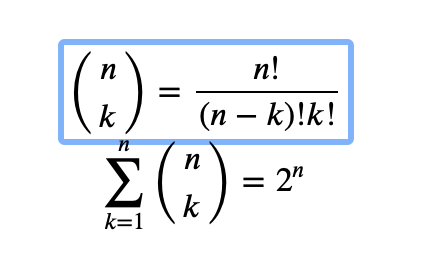

# Combinatorics Analysis

This repository exists to work on analyzing combinations of co-occuring "items". Initially
these "items" will be ICD-10 diagnosis codes but in the future can migrate to biomedical concepts,
drug terms, and more. Much research has been done, specifically with poly-substance drug use. However,
_most_ of this research focuses on either pair-wise or triplet analysis. The goal of this project is to expand
upon all of that existing work to enable N-combinations analysis. However, the problem occurs when considering 
this approach as the number of combinations grows exponentially with each N+1 iteration following the below formula: 

The permutation count (i.e. order-maintained combinations) will grow at an even higher rate. Thus it is imperative to 
develop either 1) a highly performant solution, likely with a limit function to avoid endless computation, or 2) an 
interactive solution that allows users to dynamically query deeper or shallower into the combinatoric tree.

The goal of this project, after assembling the combinations, its actually quite simple: 

> To give the conditional probability __distribution__ for a combination (X).

In this case "X" can represent either a single "item" (F10) or a series of items all of which must be present (F10, F15).

This tool also will want to take a second data input of the _date_ to allow time-series analysis and grouping. For example,
answering the question, "What is the probability distribution for fentanyl + heroin in May 2022 vs July 2020?". 
Similarly, this tool will likely be able to do ICD-10 code grouping using decimal manipulation at a later stage.

This tool was inspired by collaboration with the Cuyahoga County Medical Examiner Office.

